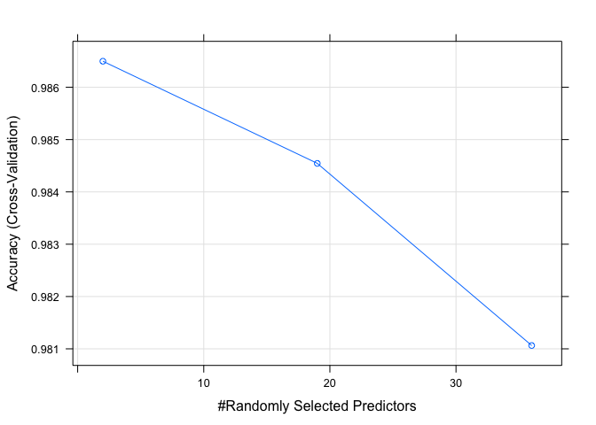

# Pattern Recognition of the Quality of Human Activities
oespinga2  
### Background
In this work we aim to predict the "quality" of certain [human activities](http://groupware.les.inf.puc-rio.br/har#wle_paper_section). Five ways to perform the same exercise at different levels of "quality" and number of repetitions were recorded with four sensors (arm, forearm, belt, and dumbbell). The sensors captured several features at various time interval lengths (from 5 second to 2.5 seconds) including features on the Euler angles (roll, pitch and yaw), as well as the raw accelerometer, gyroscope and magnetometer readings, see [@velloso2013] for more details on the study.


### Training dataset
The dataset contains information on six individuals, which performed one set of 10 repetitions of a predetermined exercise in five different manners (recorded in variable *classe* as A to E). In total the dataset containts 19622 observations given that the sensors recorded serveal features within repetitions.

The following plots show scatterplots of the Euler angles features (totals) across devices and subjects per each quality classification level (A to E)

   

Interestingly, the variation within subjects for the belt device seems to be smaller than the variation between subjects. However, the other devices show more complex patterns, none of them seem to follow any linear trend whatsoever. Further, it is interesting that in some cases the range of the measurements seem to decrease as the "quality" of the exercise diminshed (i.e. moving from grid A to E).

### Feature selection
In the study [@velloso2013] the authors consider 17 features to include in their pattern recognition approach. We observe that in most cases, variables associated with the range and variation of the vector of measurements (raw accelerometer, gyroscope and
magnetometer readings) were considered as predictive features. For this reason, we select these features along with the sum of the Euler angles (roll,yaw,pitch) for further investigation; part of the reason of this choice is that hese variables do not have any missing values in them. As opposed to @velloso2013, we make no distiction of the features per device, i.e. the same features are selected for all devices. Therefore a total of 36 predictive variables were selected.
  

```r
#fix variable names
names(train)<-gsub("picth","pitch",names(train))
names(test)<-gsub("picth","pitch",names(test))

#Select and Construct variables for predictive model
#names(train)

train_nw<-train[,c("X","classe","user_name","cvtd_timestamp")]

  for(dev in c("arm","forearm","dumbbell","belt"))
    for(euler in c("roll_","pitch_","yaw_")){
      colnw<-paste0(euler,dev)
      train_nw[,colnw]<-train[,colnw]
    }
for(dev in c("arm","forearm","dumbbell","belt"))
  for(meas in c("gyros_","accel_","magnet_") ){
    train_nw[,paste0(meas,dev,"_var")]<-apply(train[,paste0(meas,dev,c("_x","_y","_z"))],1,var)
    train_nw[,paste0(meas,dev,"_ran")]<-apply(train[,paste0(meas,dev,c("_x","_y","_z"))],1,function(x)max(x)-min(x))
  }
```

### Pattern Recognition Approach
Since the authors in the study proposed a random forest algorithm to classify the patterns, we follow a similar approach although with certain differences. The main one is given by the different predictor variables we aim to use. Even though more variables may lead to overfitting we consider that 36 variables (only 19 more than the ones in the study) are reasonable given the size of the dataset. 

In addition, to assess the out of sample error, we perform a 10-fold cross validation. We expect the out of sample error to be closer to the value reported in the paper of 78.2%. To do so, we use the cross-validation samples to estimate this error. Further, in order to accurately get an estimate, we generate an additional testing dataset (from the original training dataset).

The proposed algorithm along with its code is displayed below


```r
library(caret)
set.seed(1337)
training <- createDataPartition(y = train_nw$classe, p = 0.6, list = FALSE)
nopred<-which(names(train_nw) %in% c("X","user_name","cvtd_timestamp"))
train_Data <- train_nw[training, -nopred]
test_Data <- train_nw[-training, -nopred]

library(doMC)
registerDoMC(cores = 4)
ctrl <- trainControl(method = "cv")
modelFit0<-train(train_Data$classe ~., method="rf",data=train_Data, trControl = ctrl)
```

### Results

```r
print(modelFit0, digits = 3)
```

```
## Random Forest 
## 
## 11776 samples
##    36 predictor
##     5 classes: 'A', 'B', 'C', 'D', 'E' 
## 
## No pre-processing
## Resampling: Cross-Validated (10 fold) 
## 
## Summary of sample sizes: 10598, 10597, 10599, 10598, 10599, 10600, ... 
## 
## Resampling results across tuning parameters:
## 
##   mtry  Accuracy  Kappa  Accuracy SD  Kappa SD
##    2    0.986     0.983  0.00282      0.00357 
##   19    0.985     0.980  0.00302      0.00382 
##   36    0.981     0.976  0.00448      0.00566 
## 
## Accuracy was used to select the optimal model using  the largest value.
## The final value used for the model was mtry = 2.
```

The results for each of the cross-validation samples are below

```r
plot(modelFit0)
```

 


```r
modelFit0$resample
```

```
##     Accuracy     Kappa Resample
## 1  0.9881255 0.9849809   Fold02
## 2  0.9838710 0.9795919   Fold01
## 3  0.9830076 0.9785025   Fold03
## 4  0.9846939 0.9806371   Fold06
## 5  0.9898046 0.9870994   Fold05
## 6  0.9864177 0.9828142   Fold04
## 7  0.9915038 0.9892532   Fold07
## 8  0.9838573 0.9795722   Fold10
## 9  0.9881255 0.9849801   Fold09
## 10 0.9855688 0.9817397   Fold08
```

Additionally, the confusion matrix with the out of sample error estimat is presented below


```r
confusionMatrix(predict(modelFit0,test_Data), test_Data$classe)
```

```
## Confusion Matrix and Statistics
## 
##           Reference
## Prediction    A    B    C    D    E
##          A 2223   24    1    0    0
##          B    5 1481   26    0    0
##          C    0   13 1339   31    1
##          D    4    0    2 1253    5
##          E    0    0    0    2 1436
## 
## Overall Statistics
##                                          
##                Accuracy : 0.9855         
##                  95% CI : (0.9826, 0.988)
##     No Information Rate : 0.2845         
##     P-Value [Acc > NIR] : < 2.2e-16      
##                                          
##                   Kappa : 0.9816         
##  Mcnemar's Test P-Value : NA             
## 
## Statistics by Class:
## 
##                      Class: A Class: B Class: C Class: D Class: E
## Sensitivity            0.9960   0.9756   0.9788   0.9743   0.9958
## Specificity            0.9955   0.9951   0.9931   0.9983   0.9997
## Pos Pred Value         0.9889   0.9795   0.9675   0.9913   0.9986
## Neg Pred Value         0.9984   0.9942   0.9955   0.9950   0.9991
## Prevalence             0.2845   0.1935   0.1744   0.1639   0.1838
## Detection Rate         0.2833   0.1888   0.1707   0.1597   0.1830
## Detection Prevalence   0.2865   0.1927   0.1764   0.1611   0.1833
## Balanced Accuracy      0.9958   0.9854   0.9859   0.9863   0.9978
```

Further, the predicted values for the testing dataset (20 cases) is shown below. We first reconstruct the test data.frame


```r
test_nw<-test[,c("X","problem_id","user_name","cvtd_timestamp")]
  for(dev in c("arm","forearm","dumbbell","belt"))
    for(euler in c("roll_","pitch_","yaw_")){
      colnw<-paste0(euler,dev)
      test_nw[,colnw]<-test[,colnw]
    }
for(dev in c("arm","forearm","dumbbell","belt"))
  for(meas in c("gyros_","accel_","magnet_") ){
    test_nw[,paste0(meas,dev,"_var")]<-apply(test[,paste0(meas,dev,c("_x","_y","_z"))],1,var)
    test_nw[,paste0(meas,dev,"_ran")]<-apply(test[,paste0(meas,dev,c("_x","_y","_z"))],1,function(x)max(x)-min(x))
  }
predict(modelFit0,test_nw)
```

```
##  [1] B A B A A E D B A A B C B A E E A B B B
## Levels: A B C D E
```


### References
